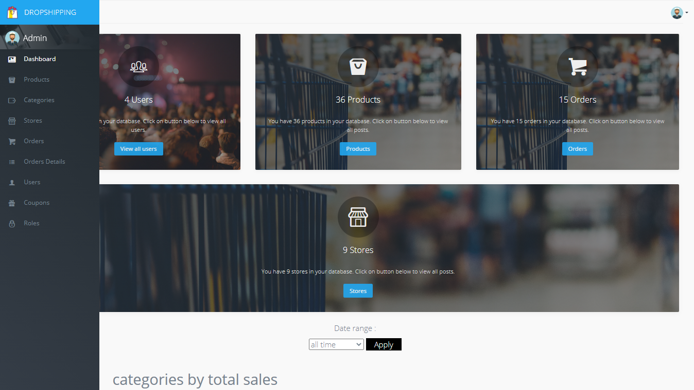
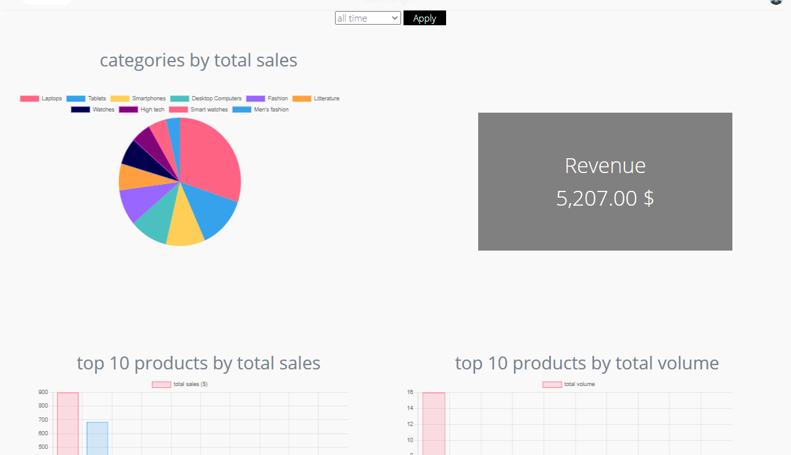
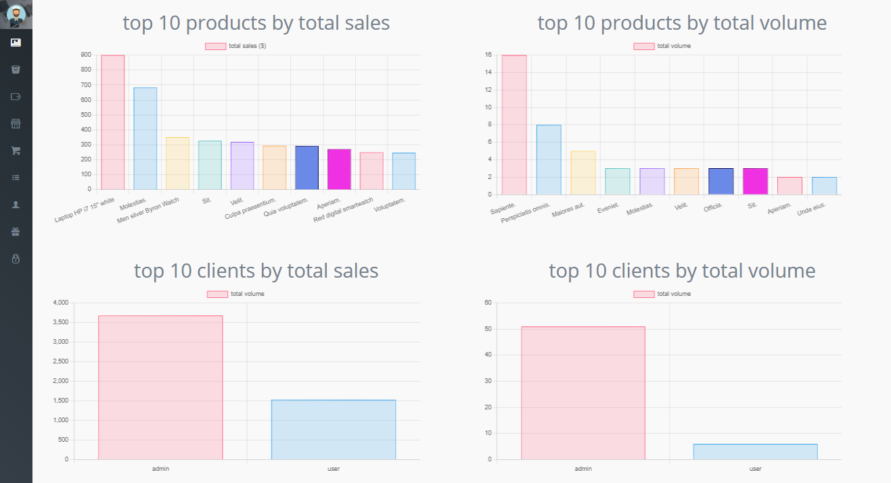
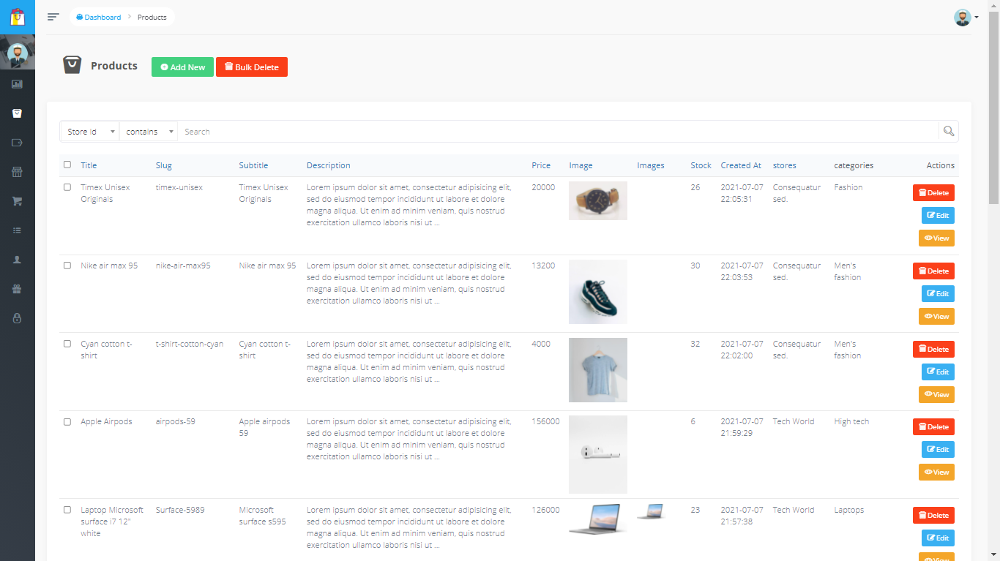
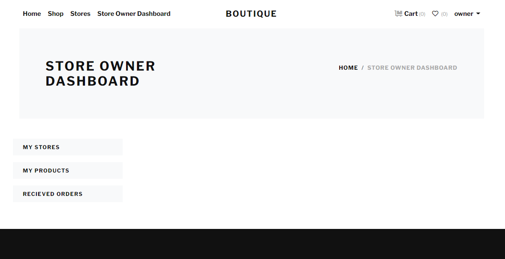
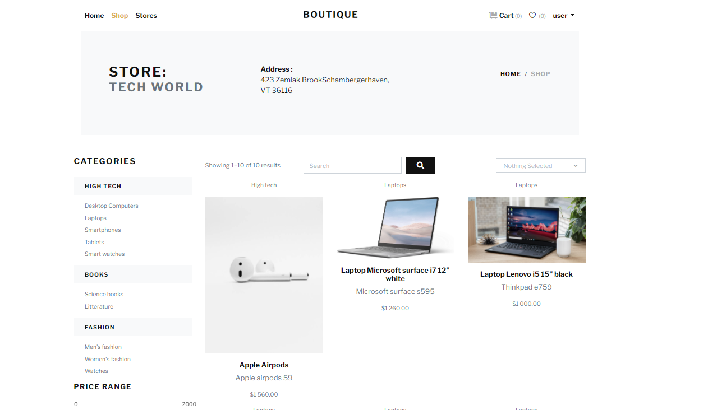
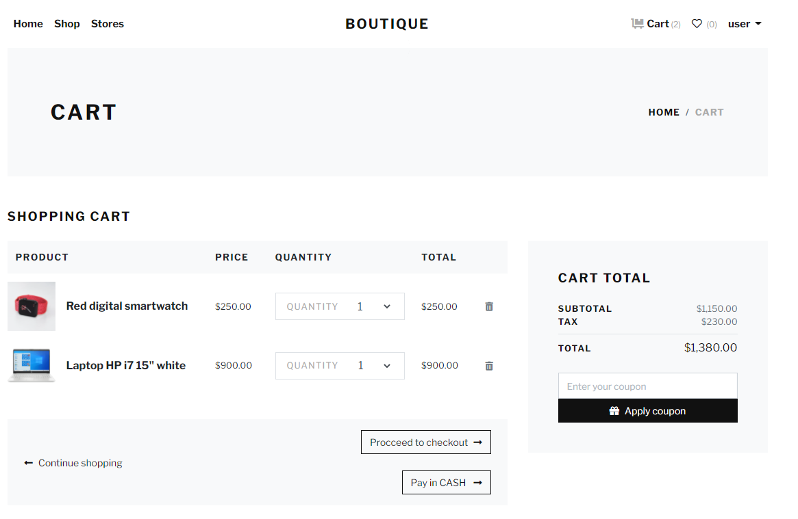
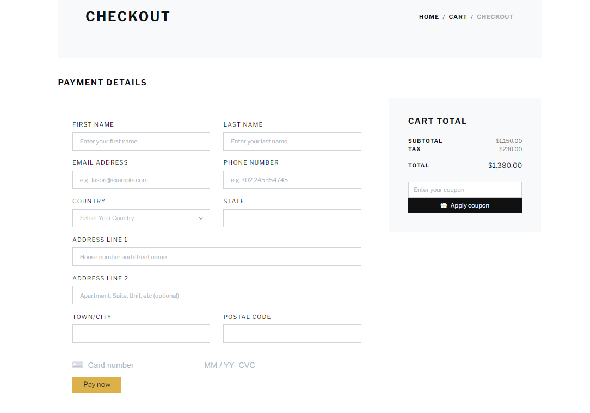

# OpenMarket  

**OpenMarket** is a multi-vendor e-commerce platform built using **Laravel**, designed to connect vendors and buyers seamlessly. It offers robust functionalities for managing products, orders, and payments while providing a feature-rich admin panel for complete control over the platform.  

---  

## Features  

### General Features  
- **Multi-Vendor System**: Support for multiple sellers to list and manage products.  
- **Admin Dashboard**: Full control over products, users, and orders.  
- **User Roles**: Admin, Vendor, and Customer roles, each with distinct capabilities.  
- **Product Filtering**: Search and filter by categories, price, and availability.  
- **Cart and Wishlist Management**: Streamlined shopping experience for customers.  
- **Payment Integration**: Supports cash and credit card payments using stripe api.  

---

## Dependencies  

The following dependencies are used in this project:  

- **PHP** (v8.0 or later)  
- **Laravel** (v8.x or later)  
- **Voyager** (v1.5): Admin panel for Laravel.  
- **Composer**: Dependency manager for PHP.  
- **MySQL**: Relational database for structured data storage.  
- **Bootstrap**: Frontend framework for responsive design.  
- **Stripe API**: Secure payment processing.  
- **jQuery/Ajax**: For dynamic interactions and asynchronous requests.  

---

## Installation  

### Prerequisites  
- **XAMPP** for PHP and MySQL installation.  
- **Composer** for dependency management.  
- Laravel 8.x or later.  

### Steps  

1. **Install PHP and MySQL**  
   - Download and install XAMPP from the [official site](https://www.apachefriends.org/index.html).  

2. **Install Composer**  
   - Download Composer from [getcomposer.org](https://getcomposer.org/) and install it.  

3. **Install Laravel**  
   - Run the following command to install Laravel globally:  
     ```bash  
     composer global require laravel/installer  
     ```  

4. **Clone the Project and Start the Server**  
   - Open a terminal inside the project folder and start the Laravel development server:  
     ```bash  
     php artisan serve  
     ```  

5. **Install Voyager**  
   - Add Voyager to the project by running:  
     ```bash  
     composer require tcg/voyager  
     ```  
   - Install Voyager:  
     ```bash  
     php artisan voyager:install  
     ```  
     Alternatively, you can run these commands step by step:  
     ```bash  
     php artisan migrate  
     php artisan db:seed --class=VoyagerDatabaseSeeder  
     php artisan storage:link  
     composer dump-autoload  
     ```  

6. **Create an Admin User**  
   - Use the following command to create an admin user:  
     ```bash  
     php artisan voyager:admin admin@admin.com --create  
     ```  
   - If you encounter the error `'route not defined'` on the Voyager page, comment out the **widgets** section in `/config/voyager.php`.  

7. **Setup the Admin Panel**  
   - Execute the provided SQL script to configure the admin panel.  

8. **Workaround for Viewing BREAD**  
   - Manually create a BREAD (Browse, Read, Edit, Add, Delete) to display previous entries, then delete it after viewing.  

9. **Seed the Database**  
   - Run the following command to populate the database with initial data:  
     ```bash  
     php artisan db:seed  
     ```  

10. **Configure the Menu Builder**  
    - Navigate to the Voyager menu builder in the admin panel, make edits to the menu, and save. The menu will now appear correctly.  

---  

## Folder Structure  

```plaintext  
OpenMarket/  
├── app/                # Core application logic  
├── database/           # Migrations and seeders  
├── public/             # Public assets  
├── resources/          # Views and frontend templates  
├── routes/             # API and web routes  
├── config/             # Configuration files  
├── .env                # Environment variables  
├── artisan             # CLI entry point  
└── README.md           # Project documentation  
```  

---  

## Screenshots  

### Admin Dashboard  
  
  
  

### Products CRUD  
 

### Vendor Product Management  
  

### Store Page  
  

### Product Page  
  

### Customer Cart  
  

### Checkout Page  
  

---  

## Contributing  

Contributions are welcome!  

1. Fork the repository.  
2. Create a new branch (`feature/my-feature`).  
3. Commit your changes (`git commit -m 'Add feature'`).  
4. Push to the branch (`git push origin feature/my-feature`).  
5. Open a pull request.  

---  

## License  

This project is licensed under the [MIT License](LICENSE).  

---  

## Contact  

- **Author**: [Said Abderrahmane](https://github.com/SaidAbderrahmane)  
- **LinkedIn**: [linkedin.com/hadj-said-abderrahmane](https://linkedin.com/hadj-said-abderrahmane)  

---  

Happy coding! 🚀  